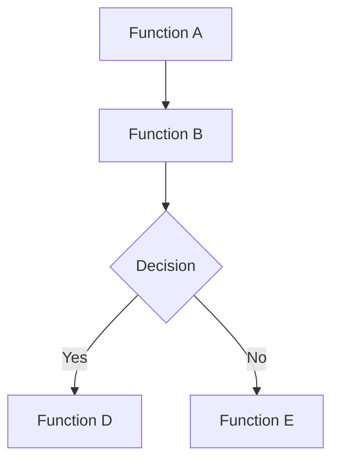
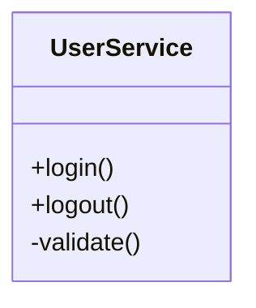
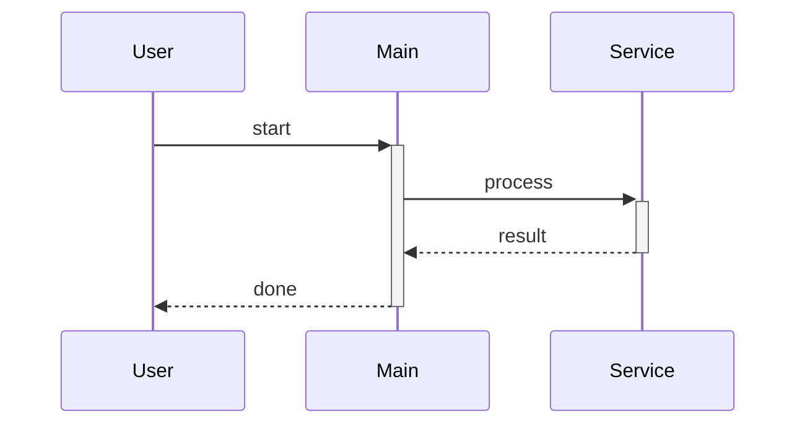

# 🎨 Flow Diagram Visualization Guide

## Overview

Vibe Flow now generates **beautiful, interactive diagrams** from your code analysis! No more staring at raw JSON—visualize your code flow in stunning clarity.

## ✨ Features

### 3 Diagram Types

1. **📊 Flowchart** - Function call flow
2. **🏛️ Class Diagram** - Class relationships  
3. **⏱️ Sequence Diagram** - Execution timeline

### Interactive Features

- **Zoom In/Out** - Examine details or see the big picture
- **Download SVG** - Save diagrams for documentation
- **Auto-Highlighting** - Execution paths highlighted automatically
- **Real-time Stats** - See metrics at a glance
- **Dark Theme** - Easy on the eyes

## 🚀 Quick Start

### Method 1: Auto-Show After Analysis

1. Run any analysis command
2. When results appear, click **"Show Diagram"**
3. Choose your diagram type
4. View the beautiful visualization! 

### Method 2: Manual Command

1. Run an analysis first (any type)
2. Open Command Palette (`Ctrl+Shift+P`)
3. Run: `Vibe Flow: Show Flow Diagram`
4. Choose diagram type
5. Enjoy the visualization!

## 📊 Diagram Types Explained

### Flowchart Diagram

**Best for:** Understanding function call relationships

**Shows:**
- Functions as rounded rectangles
- Classes as double-bordered rectangles
- Methods as regular rectangles
- Call relationships as arrows
- Highlighted execution paths (if runtime data available)

**Example:**
```
UserService
    ↓
  login()
    ↓
validateCredentials()
    ↓
  checkPassword()
```

**When to use:**
- Understanding code flow
- Finding call chains
- Debugging execution paths
- Code reviews

### Class Diagram

**Best for:** Object-oriented code structure

**Shows:**
- Classes and their methods
- Method visibility (public/private)
- Async methods
- Class relationships

**Example:**
```
┌─────────────┐
│ UserService │
├─────────────┤
│ + login()   │
│ + logout()  │
│ - validate()│
└─────────────┘
```

**When to use:**
- Understanding class structure
- Reviewing OOP design
- Documentation
- Architecture planning

### Sequence Diagram

**Best for:** Runtime execution flow

**Shows:**
- Execution timeline
- Function call sequence
- Actor interactions
- Call stack progression

**Example:**
```
User → main → processData → transform → validate
```

**When to use:**
- Understanding execution order
- Debugging runtime issues
- Performance analysis
- Tracing user actions

## 💡 Use Cases

### Use Case 1: Code Review

**Scenario:** Reviewing a pull request

```
1. Run static analysis on the branch
2. Click "Show Diagram"
3. Choose "Flowchart"
4. See new functions and their connections
5. Verify the changes make sense
```

### Use Case 2: Debugging

**Scenario:** Understanding why a bug happens

```
1. Start debugging (F5)
2. Run "Start Auto-Capture"
3. Reproduce the bug
4. Run "Stop Auto-Capture"
5. Click "Show Diagram"
6. Choose "Sequence Diagram"
7. See exact execution path that led to bug!
```

### Use Case 3: Documentation

**Scenario:** Creating architecture docs

```
1. Run static analysis on your codebase
2. Show flowchart diagram
3. Click "Download SVG"
4. Include in your documentation
```

### Use Case 4: Onboarding

**Scenario:** New developer learning the codebase

```
1. Run static analysis
2. Show class diagram
3. See all classes and their relationships
4. Switch to flowchart
5. Understand how they interact
```

## 🎯 Tips & Tricks

### Tip 1: Limit Complexity

The diagram shows the most connected nodes first. If your codebase is huge:
- Focus on specific directories
- Use custom analysis input
- The system automatically limits to 50 nodes for clarity

### Tip 2: Zoom for Detail

```
- Use "Zoom In" button to examine node details
- Use "Zoom Out" to see the big picture
- Use "Reset" to return to original size
```

### Tip 3: Download for Docs

```
1. Generate your diagram
2. Click "Download SVG"
3. Include in your documentation
4. SVG scales perfectly at any size!
```

### Tip 4: Combine with Auto-Capture

```
1. Run auto-capture during debugging
2. Stop capture
3. Choose "Sequence Diagram"
4. See EXACTLY what executed!
```

### Tip 5: Use Multiple Views

```
1. Open flowchart in one panel
2. Run analysis again
3. Open class diagram in another panel
4. Compare different perspectives!
```

## 🎨 Visual Examples

### Before (JSON):
```json
{
  "nodes": [
    {"id": "func1", "name": "processData"},
    {"id": "func2", "name": "validateInput"}
  ],
  "edges": [
    {"from": "func1", "to": "func2"}
  ]
}
```

### After (Diagram):
```
┌──────────────┐
│ processData  │
└──────┬───────┘
       │ calls
       ↓
┌──────────────┐
│validateInput │
└──────────────┘
```

Much better! 🎉

## 📈 Understanding the Stats Panel

When you open a diagram, you'll see:

```
📊 Analysis Summary
━━━━━━━━━━━━━━━━━
Total Symbols:     127
Total Connections:  89
Files Analyzed:     15
Execution Steps:    42  (if runtime data)
```

**What it means:**
- **Total Symbols**: Functions, classes, methods found
- **Total Connections**: How many calls between them
- **Files Analyzed**: Number of source files
- **Execution Steps**: Runtime events captured (if applicable)

## 🛠️ Customization

### Diagram Direction

Flowcharts can flow in different directions:
- **TD** (Top-Down) - Default
- **LR** (Left-Right) - Wide layouts
- **BT** (Bottom-Top) - Inverted
- **RL** (Right-Left) - Alternative

*Currently set to TD by default. Future versions will allow customization.*

### Node Limits

- Default: 50 nodes
- Prevents overwhelming diagrams
- Shows most important/connected nodes first
- Adjustable in future versions

### Color Scheme

- Automatically matches VS Code theme
- Dark mode optimized
- Highlighted nodes in red/pink
- Clear, readable colors

## 🐛 Troubleshooting

### Problem: "No analysis result found"

**Solution:** Run an analysis first before showing diagram:
```
1. Run "Analyze Static Call Graph"
2. Wait for completion
3. Then run "Show Flow Diagram"
```

### Problem: Diagram looks too crowded

**Solution:** The system limits to 50 nodes, but you can:
- Analyze specific subdirectories only
- Use custom input with selected files
- Focus on specific entry points

### Problem: Diagram doesn't show execution path

**Solution:** You need runtime data:
```
1. Use "Auto-Capture" during debugging
2. OR provide runtime trace manually
3. Then flowchart/sequence will highlight execution
```

### Problem: Download button doesn't work

**Solution:** 
- Make sure the diagram fully rendered
- Try clicking Reset first
- Check browser console (F12) for errors

## 🔧 Technical Details

### Mermaid.js

Diagrams are generated using Mermaid.js:
- Industry-standard diagram library
- Text-based diagram format
- Renders to SVG for crisp quality
- Widely supported

### Rendering

- Client-side rendering in webview
- No external servers needed
- All processing local
- Privacy-friendly

### Performance

- Optimized for up to 50 nodes
- Larger codebases automatically filtered
- Fast rendering (< 1 second typically)
- Smooth zoom/pan

## 📚 Diagram Syntax (For Reference)

If you want to edit the raw Mermaid code:

### Flowchart


### Class Diagram


### Sequence Diagram


## 🎓 Learning Path

**Beginner:**
1. Run static analysis
2. Show flowchart
3. Explore with zoom

**Intermediate:**
4. Try class diagram
5. Use auto-capture
6. View sequence diagram

**Advanced:**
7. Download diagrams for docs
8. Combine multiple analyses
9. Use custom inputs for focus

## 🚀 Advanced Workflows

### Workflow 1: Before/After Comparison

```
1. Run static analysis on main branch
2. Save diagram as "before.svg"
3. Switch to feature branch
4. Run analysis again
5. Save diagram as "after.svg"
6. Compare the two diagrams!
```

### Workflow 2: Feature Tracing

```
1. Set breakpoint at feature entry
2. Start auto-capture
3. Execute the feature
4. Stop auto-capture
5. Show sequence diagram
6. See complete feature execution path!
```

### Workflow 3: Documentation Generation

```
1. Run static analysis
2. Show class diagram → Download
3. Show flowchart diagram → Download
4. Include both in README
5. Automated visual documentation!
```

## 💬 Feedback

The diagram feature is brand new! If you have suggestions:
- What diagram types would you like?
- What customization options?
- What's confusing or unclear?

Let us know and we'll improve it!

## 🎉 Summary

**You now have:**
- ✅ Beautiful visual diagrams
- ✅ 3 diagram types
- ✅ Interactive controls
- ✅ Auto-highlighting
- ✅ Download capability
- ✅ Integrated with all analysis modes

**No more raw JSON!** Your code flow is now visible, understandable, and beautiful. 

---

**Happy Visualizing! 🎨**

Transform your code analysis from data to insights with stunning visual diagrams!


